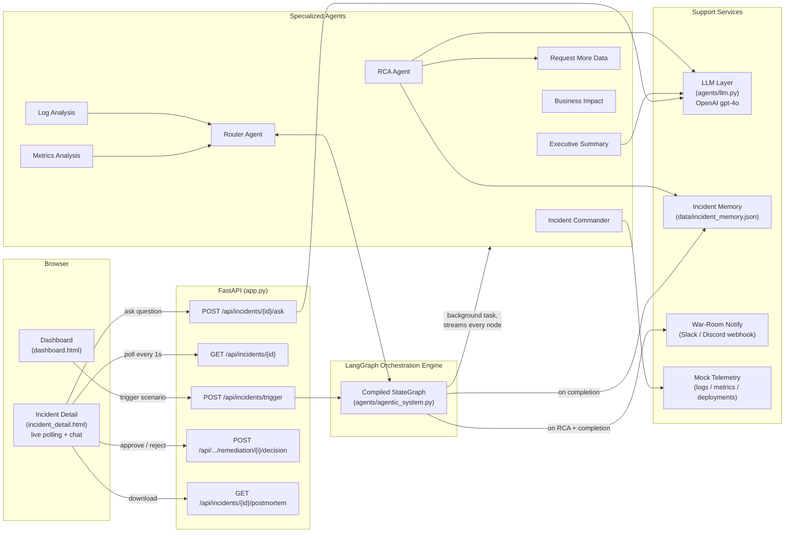
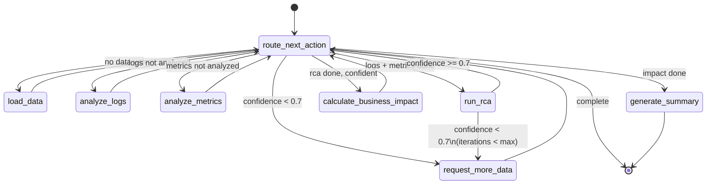
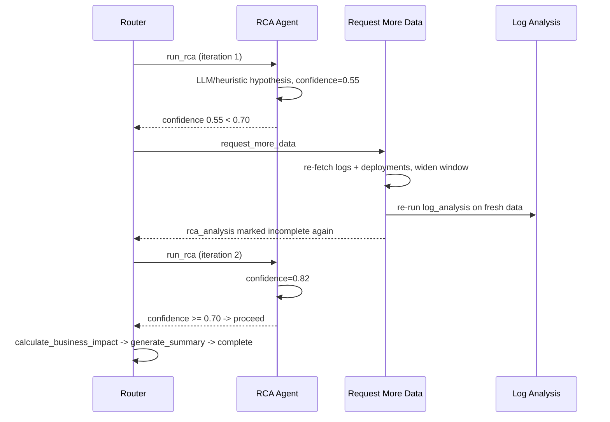

# Architecture

Technical deep-dive into how the AI Operations Command Center is built. For a project overview, see [SUBMISSION.md](SUBMISSION.md). For the end-to-end run-through, see [WORKFLOW.md](WORKFLOW.md).

## 1. System Overview

**Three-tier design**: a stateless FastAPI layer for I/O, a LangGraph engine that owns orchestration state and control flow, and a set of single-responsibility agent functions that are pure `IncidentState -> IncidentState` transforms. No agent calls another agent directly — everything is mediated by the graph, which is what makes the routing logic swappable and auditable.

## 2. The Agent Graph (State Machine, Not a Pipeline)

This is the core architectural bet: incident response isn't a fixed sequence of steps, it's a control loop with a low-confidence retry path. The graph is compiled from conditional edges, not a linear chain:

Every transition passes back through `route_next_action`, a single decision point (`agents/router_agent.py`). This is deliberate:

- **`valid_next_actions(state)`** is the deterministic guardrail — it computes the *legal* action set from `completed_steps` and `rca_confidence` alone. It can never be wrong because it's pure bookkeeping.
- **`route_next_action_agentic(state)`** hands that legal set to the LLM as a constrained choice ("pick exactly one of these") and asks it to reason about *why*, given iteration count and evidence gathered so far. If the LLM picks something outside the legal set, the guardrail overrides it and the override is logged as `source: "guardrail"`.
- With zero or one legal action, the LLM isn't even called — there's nothing to decide. This keeps latency and cost down without losing autonomy where it matters (the confidence-gated retry decision).

This hybrid is the difference between "an LLM wrapped in a for-loop" and an actual agentic system: the LLM has real decision authority, bounded by a deterministic safety net that's cheap to verify and impossible to hallucinate past.

## 3. The Self-Correcting Confidence Loop

Most incident-response demos run analysis once and print a result. This system treats a low-confidence hypothesis as a reason to keep investigating:

Bounded by `max_iterations` (default 5) so it can't loop forever. Every iteration is recorded in `agent_invocations` with the confidence at that point, so the audit trail shows the system's own uncertainty and how it resolved it — this is visible live in the incident detail page's "Agent Reasoning & Audit Trail" panel.

## 4. Evidence-Graded RCA (Anti-Hallucination by Construction)

`agents/rca_agent.py` doesn't just ask the LLM for a root cause — it constrains the *shape* of the answer via a strict JSON schema (`RCA_SCHEMA`) and instructs it that every piece of `supporting_evidence` must cite something **literally present** in the log/metric/deployment payloads it was given. Two things fall out of this:

1. **`ruled_out_hypotheses`** — the model is required to name 2 alternative causes it considered and the specific data point that ruled each one out. This mirrors how a real SRE reasons (differential diagnosis), and it's a strong hallucination check: an LLM that can't articulate why it rejected the obvious alternative is usually the one making things up.
2. **`deploy_correlation`** — a temporal-reasoning field. If a deployment timestamp precedes the incident within a plausible window, the system produces a sentence like *"Incident began 4 minutes after deployment v2.3.1, which reduced the DB pool size."* This is computed deterministically as a fallback (`rca_analysis.py::_deploy_correlation`) and reasoned about by the LLM when available, so the deployment-correlation callout is present in both offline and LLM-backed modes.

Every LLM-backed agent (router, RCA, summary, Q&A) follows the same pattern: **try the LLM with a strict schema, catch any failure, fall back to a deterministic heuristic path that produces a structurally identical result.** This means the entire system is demoable with zero API keys — `agents/llm.py::llm_available()` gates every call, and `get_provider()` returns `None` with no key set. Nothing in the FastAPI layer or frontend needs to know which path produced the answer.

## 5. Incident Memory ("Seen This Before")

`agents/memory.py` persists every completed investigation to `data/incident_memory.json` and matches new incidents against history two ways:

- **Same root-cause hypothesis** (exact string match today; embeddings are the natural upgrade — see roadmap)
- **Same service + overlapping log-anomaly-type signature** (e.g. two `payment-api` incidents both showing `connection_error` + `timeout`)

A match surfaces as its own `agent_invocations` entry (`agent: "memory"`) with a plain-language callout ("This matches incident #3 from 2026-07-01 — same pattern") and renders as a dedicated "Seen Before" section in the UI. This turns every resolved incident into context for the next one without requiring a vector database for the current scenario set — the interface (`find_similar_incidents` / `record_incident`) is swap-in-ready for a real embedding store.

## 6. Human-in-the-Loop Approval Gates

Recovery recommendations are never auto-executed. `POST /api/incidents/{id}/remediation/{step}/decision` requires an explicit `approved`/`rejected` per recommendation, recorded with a timestamp. This is a deliberate stance: the system will autonomously *investigate* end-to-end, but every action with real-world blast radius (rollback, restart, pool-size change) stops at a human gate. The postmortem export (`_postmortem_markdown` in `app.py`) prints each recommendation next to its decision status (`approved` / `rejected` / `pending review`), so the approval trail becomes part of the permanent record.

## 7. IncidentState — the Shared Contract

Every agent reads and mutates one dataclass (`agents/__init__.py`). This is the entire "API" between agents:

| Field | Set by | Read by |
|---|---|---|
| `raw_logs`, `raw_metrics`, `deployment_changes` | incident_commander | log_analysis, metrics_analysis, rca_agent |
| `log_anomalies`, `metric_anomalies` | log_analysis, metrics_analysis | rca_agent, business_impact, executive_summary |
| `root_cause`, `rca_confidence` | rca_agent | router (loop decision), business_impact, executive_summary, memory |
| `similar_incidents` | rca_agent (via memory) | executive_summary, qa, UI |
| `affected_users`, `estimated_revenue_impact_per_minute` | business_impact | executive_summary, notify |
| `engineering_summary`, `executive_summary`, `recovery_recommendations` | executive_summary | UI, postmortem export |
| `agent_invocations` | every agent (append-only) | UI audit trail, postmortem timeline |
| `completed_steps`, `analysis_iterations`, `current_status`, `next_action` | router + each node | router (control flow), UI status banner |

Because state is a plain dataclass converted to/from `dict` at graph boundaries (`_as_updates`), adding a new agent is: add a field if needed, add a node function, add it to `valid_next_actions`, add a conditional edge. No agent needs to know about any other agent's internals.

## 8. Live Streaming, Not Request/Response

`app.py::_run_analysis` doesn't call the graph and wait — it uses `graph.astream(..., stream_mode="values")` and writes the incident record to `incident_store` **after every single node**, including mid-loop iterations. The frontend polls `GET /api/incidents/{id}` every second and re-renders. As a result, the status banner cycles through `data_loaded` → `logs_analyzed` → `metrics_analyzed` → `rca_completed` → `requesting_deeper_analysis` → `rca_completed` → `impact_calculated` → `complete` in real time, rather than resolving directly from a loading state to a static final report.

## 9. Tech Stack

| Layer | Choice | Why |
|---|---|---|
| Orchestration | LangGraph (`StateGraph`) | Conditional edges give a real state machine with loops, not a linear chain |
| LLM | OpenAI `gpt-4o`, strict JSON schema mode | Structured outputs eliminate parsing failures; strict mode rejects malformed shapes at the API level |
| Backend | FastAPI + `asyncio.create_task` | Non-blocking trigger endpoint; analysis streams in the background while the UI polls |
| Frontend | Vanilla HTML/CSS/JS, no build step | Minimal setup — clone, `python app.py`, open browser |
| Memory | Flat JSON file | Sufficient for the current scenario corpus; interface is embedding-store-ready |
| Notifications | Slack/Discord incoming webhook (auto-detected by URL) | One `.env` var (`WAR_ROOM_WEBHOOK_URL`), zero SDK dependency |
| Testing | pytest, 3 end-to-end scenarios + LLM-layer unit tests | Confidence thresholds and anomaly counts are asserted per scenario |

## 10. Extensibility

To add a new investigative capability (say, a distributed-tracing agent):

1. Add fields to `IncidentState` for its outputs.
2. Write `agents/tracing_analysis.py` exposing `tracing_analysis(state) -> state`, following the existing pattern (mutate state, append an `agent_invocations` entry with `reasoning`).
3. Add a node + `completed_steps` entry in `agentic_system.py`.
4. Add the action to `valid_next_actions` in `router_agent.py` with an entry in `ACTION_DESCRIPTIONS`.

No changes needed anywhere else — the router, the streaming loop, the audit trail, and the UI all generalize automatically because they iterate over `agent_invocations` and `completed_steps` rather than hardcoding agent names.
